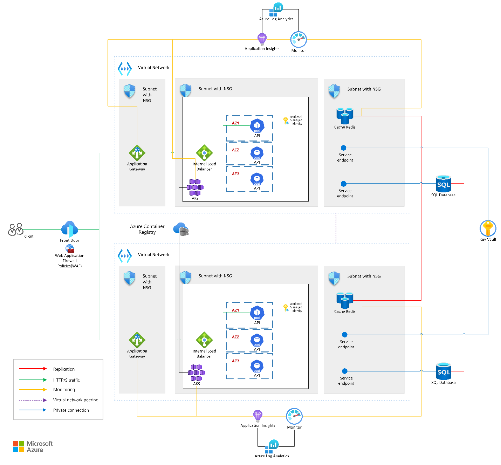

# Cross-Region ECommerce Reference Application

The Cross-Region ECommerce Reference Application is a synthetic workload that mirrors a simple, bare-bones, e-commerce platform. It is built on top of the [Resilient ECommerce Reference Application](https://github.com/microsoft/resilient-ecommerce-reference-app) and its purpose is to demonstrate how to further leverage Azure Resiliency best practices to achieve cross-regional resiliency and ensure availability during regional outages.

For a better understanding of the project, consider checking the original application before diving into this one. We will expand only on the improvements that we made, and not on the whole architecture.

Follow the instructions in [the setup readme file](doc/SETUP.md) to start using the app. It can be used for educational purposes or as a starting point for developing new resilient applications.

# Content

- [Introduction](#introduction)
- [Overview of Cross-Region Enhancements](#overview-of-cross-region-enhancements)
- [Component Details](#component-details)
  - [Networking Architecture](#networking-architecture)
  - [Storage Architecture](#storage-architecture)
  - [Compute Architecture](#compute-architecture)
- [Failover](#failover)

# Introduction

The initial [Resilient Ecommerce Reference Application](https://techcommunity.microsoft.com/blog/azurearchitectureblog/availability-zone-resiliency-on-ecommerce-reference-application/4351732) demonstrated the best practices to achieve regional resiliency using Azure's availability zones. Expanding on this foundation, in the current article we aim to achieve cross-region resiliency, ensuring high availability and disaster recovery capabilities across multiple geographic regions. This document outlines the enhancements made to extend the application into a cross-region resilient architecture.

# Overview of Cross-Region Enhancements

The main architectural change needed to extend the application to a cross-region approach was to replicate the existing zonal resilient setup across multiple Azure regions and enable failover mechanisms for seamless operation during regional outages.

Below is a visual representation of the new architecture:

# Component Details

## Networking Architecture

The networking architecture has been extended to support cross-region traffic management.

[**Azure Front
Door**](https://learn.microsoft.com/en-us/azure/frontdoor/front-door-overview) serves as the global entry point, routing traffic to the primary region. In case of a disaster, the traffic is redirected to the secondary region.

[**Global Virtual Network
Peering**](https://learn.microsoft.com/en-us/azure/virtual-network/virtual-network-peering-overview) is used to link together the virtual networks of the two regions. This enables the Redis Caches and SQL Databases to communicate with each other, keeping them in sync and allowing them to perform the switchover procedure. This change allowed us to remove the previous DNS zone groups.

[**Service
Endpoints**](https://learn.microsoft.com/en-us/azure/virtual-network/virtual-network-service-endpoints-overview) provide secure and direct connectivity with the Azure Virtual Network for the **SQL Databases** and **Key Vault**. They allow access to these services without exposing them to the public internet, reducing the attack surface and enhancing security.

## Storage Architecture

**Azure SQL Database**, **Azure Cache for Redis** and **Azure Container Registry** now employ geo-replication to ensure data availability across regions. **Azure Key Vault** is cross-region resilient by default as it automatically replicates the data to [the Azure paired region](https://learn.microsoft.com/en-us/azure/reliability/regions-paired).

Read more about geo-replication for Azure SQL and [Azure Cache for Redis](https://learn.microsoft.com/en-us/azure/azure-cache-for-redis/cache-how-to-geo-replication).

## Compute Architecture

The Azure Kubernetes Service (AKS) clusters are deployed across multiple regions, with each cluster running in a minimum of three Availability Zones. The autoscaling and load distribution mechanisms from the original setup are retained, ensuring optimal performance and high availability. Read more about multi-region AKS clusters.

The application supports both Active-Active and Active-Passive states, determined by the AKS configuration. In an Active-Active state, the secondary AKS is always running, providing a faster switchover at the cost of higher expenses. Conversely, in an Active-Passive state, the secondary AKS is deployed but not started, reducing costs but resulting in a slower switchover. Additionally, the secondary AKS can be configured with fewer resources for further cost savings.

# Failover

The failover procedure consists of migrating the compute, storage and networking services to the secondary region. Firstly, the AKS cluster is started in the secondary region. In an Active-Active configuration, this step is skipped as the cluster is already running. Then, the SQL Database and Redis Cache are synced with their replicas and the secondary instances are elevated to the primary role. The traffic is reconfigured through the Front Door profile to hit the services in the new region.

Controlled failover is crucial for keeping systems running smoothly during a disaster. When things go wrong, an on-call engineer can start the failover process to quickly move operations to a backup system, minimizing any potential issues. Follow the [switchover document](doc/SWITCHOVER.md) to start experimenting with switchover / failover over the reference application.
